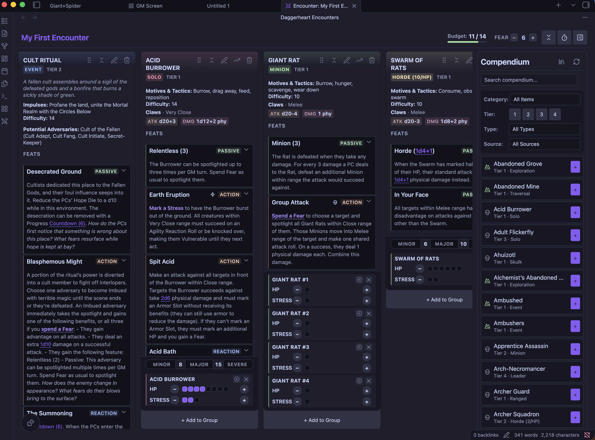
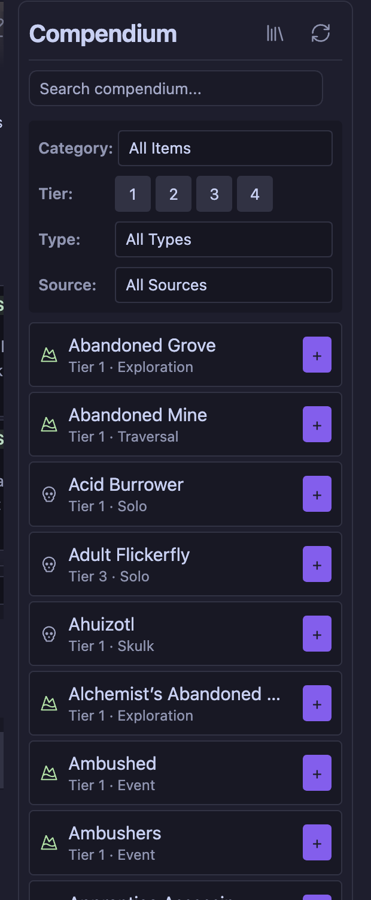
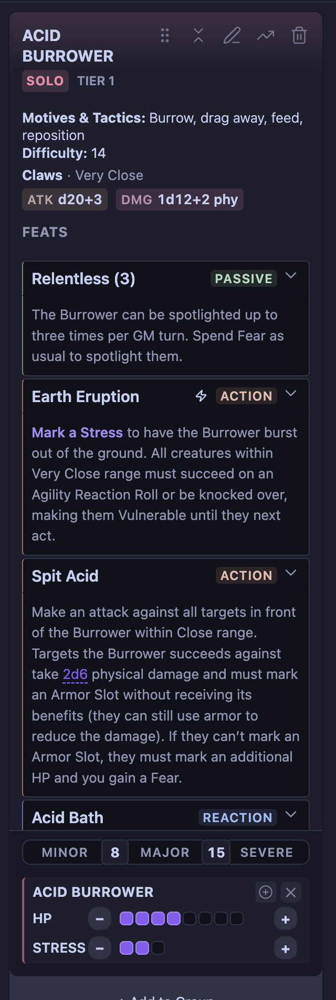
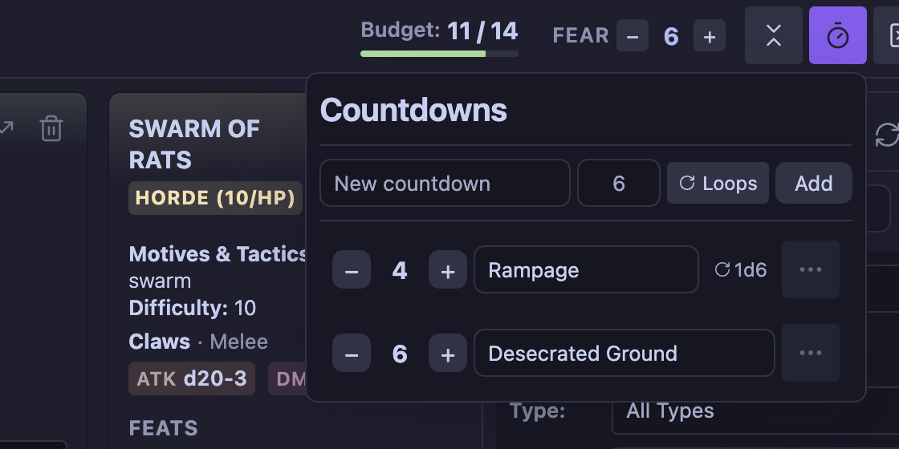
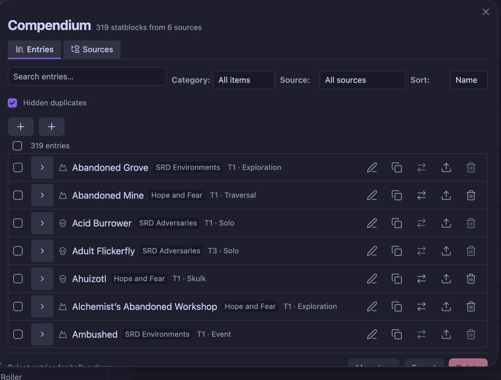

# Daggerheart Toolkit

An Obsidian plugin for Daggerheart GMs. Build encounters from a searchable
compendium, run them from a side panel with live HP, Stress and conditions,
track Fear and countdowns, and drop statblocks into your session notes.

Ships with the Daggerheart SRD: 129 adversaries and 19 environments. Your own
homebrew lives beside them, either as JSON or as fenced code blocks in ordinary
vault notes.



## Contents

- [Install](#install)
- [Feature tour](#feature-tour)
- [Statblocks in notes](#statblocks-in-notes)
- [Content sources](#content-sources)
- [Markdown homebrew compendium](#markdown-homebrew-compendium)
- [Personal content you may not redistribute](#personal-content-you-may-not-redistribute)
- [Dice integration](#dice-integration)
- [Browser extension](#browser-extension)
- [Commands](#commands)
- [Development](#development)

## Install

The plugin is not yet in Obsidian's community plugin directory, so pick one of
the three routes below. BRAT is the easiest to keep updated.

### With BRAT (recommended)

[BRAT](https://github.com/TfTHacker/obsidian42-brat) installs plugins straight
from a GitHub repository and keeps them up to date, including pre-releases.

1. In Obsidian, open **Settings → Community plugins**, and turn off Restricted
   mode if it is still on.
2. **Browse**, search for `BRAT`, then install and enable **Obsidian42 - BRAT**.
3. Open **Settings → BRAT → Add beta plugin**.
4. Paste this repository URL:

    ```text
    https://github.com/Eppinguin/obsidian-daggerheart-toolkit
    ```

5. Choose the latest version, leave **Enable after installing** on, and click
   **Add plugin**.

BRAT will check for new releases on Obsidian startup. To update immediately,
run the **BRAT: Check for updates to all beta plugins** command from the
command palette.

### Manual install from a release

1. Download `main.js`, `manifest.json` and `styles.css` from the
   [latest release](https://github.com/Eppinguin/obsidian-daggerheart-toolkit/releases/latest).
   They are attached as individual files; you can also take the
   `daggerheart-toolkit-<version>.zip` and unpack it.
2. Create the folder `<your vault>/.obsidian/plugins/daggerheart-toolkit/` and
   put the three files in it.
3. Copy the release's `data/` folder in alongside them — that is the bundled
   SRD compendium.
4. Reload Obsidian, then enable **Daggerheart Toolkit** under
   **Settings → Community plugins**.

### From source

```bash
git clone https://github.com/Eppinguin/obsidian-daggerheart-toolkit
cd obsidian-daggerheart-toolkit
pnpm install
pnpm run build
```

Copy `main.js`, `manifest.json`, `styles.css` and `data/` into
`<your vault>/.obsidian/plugins/daggerheart-toolkit/`, or clone directly into
that folder and build in place. `pnpm run dev` rebuilds on change.

### Requirements

Obsidian 0.15.0 or newer. Desktop and mobile.

## Feature tour

### Encounter builder

Open it from the swords icon in the ribbon, or the **Open Encounter Builder**
command. It works in the main workspace or docked to a side panel, and the
layout adapts when the panel is narrow.



The compendium panel beside the encounter area searches every enabled source at
once, and filters by category (adversary or environment), tier, type, and
source.
Adding an adversary creates an _instance_ — its own card with its own HP,
Stress, conditions and name, so three Jagged Knife Bandits can be tracked
apart. Cards can be renamed inline, reordered by drag and drop, grouped, and
collapsed to a header bar when the panel gets tight.

Encounters are saved by name and can be reopened later from **Manage Saved
Encounters**.

### Running a fight



Each card tracks HP and Stress, and carries the SRD conditions (Hidden,
Restrained, Vulnerable) plus adversary-specific ones, colour-coded and
toggled in place. Features are listed with their type — Passive, Action,
Reaction — and start collapsed or expanded depending on your settings.

Two things on a card reach beyond it:

- **Spend Fear from a feature.** A feature's Fear cost is clickable, so you can
  pay for it from the card rather than the header tracker.
- **Summons.** A feature that summons other adversaries gets a button; pick
  what to summon and how many, and the instances are added to the encounter.

There is also a **tier scaler** on the card: scale an adversary up or down a
tier and get a summary of exactly which numbers changed before you accept it.

### Fear, budget and countdowns



The header carries three trackers, each of which can be switched off in
settings:

- **Fear** — a per-encounter counter, raised and spent from the header or from
  a feature's cost text.
- **Encounter budget** — a battle-point bar for the party size, with the SRD's
  adjustments (easier/shorter, harder/longer, boosted damage, lower-tier
  adversary), which flags when you go over budget.
- **Countdowns** — named timers you tick up or down. Give one a name and a
  starting value, and turn on **Loops** for effects that repeat. A countdown can
  start from a die roll (`1d6`) instead of a fixed number.

## Statblocks in notes

Two fenced block types render outside the encounter builder.

**Embed a compendium entry** by name — the statblock stays in sync with the
compendium, so an edit there updates every note that embeds it:

````markdown
```daggerheart-embed
adversary: Acid Burrower
```
````

````markdown
```daggerheart-embed
environment: Abandoned Grove
```
````

The **Insert Adversary Statblock** and **Insert Environment Statblock**
commands write these for you, with a searchable picker.

**Write a statblock inline** with a `daggerheart-statblock` block. It renders
as a card, and it is also picked up by the compendium if the note sits in a
configured Markdown folder:

````markdown
```daggerheart-statblock
name: Acid Burrower
tier: "1"
type: Solo
description: A horse-sized insect with digging claws and acidic blood.
motives_and_tactics: Burrow, drag away, feed, reposition
difficulty: "14"
thresholds: 8/15
hp: "8"
stress: "3"
atk: "+3"
attack: Claws
range: Very Close
damage: 1d12+2 phy
experience: Tremor Sense +2
feats:
  - name: Relentless (3) - Passive
    text: The Burrower can be spotlighted up to three times per GM turn.
  - name: Earth Eruption - Action
    text: >-
      Mark a Stress to have the Burrower burst out of the ground.
```
````

**Link to a saved encounter** from a note with the **Insert Encounter Link**
command. It writes an `obsidian://dh-encounter?id=…` link that opens that
encounter in the builder.

## Content sources

Every statblock belongs to a **content source**. Out of the box there are four:
SRD Adversaries, SRD Environments, My Custom Content
(`user_data/user-adversaries.json`), and one Markdown folder. Each can be
switched on or off independently without deleting anything.



Open **Manage Compendium** — from the button in the encounter builder's
compendium panel, or from settings — to search, edit, duplicate, move, delete,
and export entries, and to manage sources. The list filters by category and
source, sorts by name, tier, type or source, and every row carries its source
as a badge. Three kinds of source can be added there:

- **Add JSON source** — an empty file in the plugin's `user_data/` folder that
  you can save entries into.
- **Add Markdown folder** — any number of vault folders to read statblocks
  from. Each gets its own name and toggle. Removing a folder source only stops
  the plugin reading it; the notes stay where they are.
- **Import JSON…** — load a statblock file either into an existing source or
  into a new source created from it. Conflicts are reviewed before anything is
  saved.

When two sources define the same name, the higher-priority one wins: Markdown
beats JSON sources, which beat the SRD. The hidden entry is not lost — turn on
**Hidden duplicates** in the manager and it is listed, struck through, with a
note saying which source is covering it.

## Markdown homebrew compendium

Add folders through **Manage Compendium → Add Markdown folder**. Use a
vault-relative path such as `Daggerheart/Homebrew`; do not include the vault
name. The field suggests folders that exist, and rejects paths that do not.

The plugin scans each configured folder and all its nested folders for fenced
`daggerheart-statblock` blocks. Leading/trailing slashes and Windows-style
backslashes are normalized automatically. Creating, editing, renaming, or
deleting Markdown files inside any configured folder reloads the compendium
automatically.

Entries from these folders can be edited from the manager like any other.
Saving rewrites **only** that one fenced block inside its note — frontmatter,
prose, links, and any other statblocks in the same file are left
byte-identical. Deleting removes just that block. Each row also gets an **Open
note** button if you would rather edit the file directly, and the edit dialog
still offers **Save a Copy** if you want the change in a JSON source instead of
in the note.

Before writing, the plugin checks that the block it is about to replace still
holds the entry it was read from. If the note changed in the meantime it
refuses and asks you to refresh, rather than overwriting the wrong statblock.

## Personal content you may not redistribute

To use material you own but cannot share, add a source in the manager and turn
on **Personal licensed content**. Entries in that source work everywhere in the
plugin but are excluded from every export path: they do not appear in the
export dropdown, they have no export buttons in the manager, and the export
service refuses them outright.

Source files live in the plugin's `user_data/` folder, which is listed in
`.gitignore`, so this content cannot be committed by accident. Note the same
folder is cleared when the plugin is reinstalled — use **Export source** in the
manager to keep a backup first. Do not paste licensed content into the Markdown
compendium folder; that lives in the vault proper and is not ignored.

## Dice integration

Damage and attack rolls on a statblock are clickable when a dice provider is
configured under **Settings → Daggerheart Toolkit → Integrations**:

- **Obsidian Dice Roller** — uses the
  [Dice Roller](https://github.com/valentine195/obsidian-dice-roller) plugin,
  which must be installed and enabled separately. Optionally with its graphical
  3D dice.
- **dddice.com** — connect with an API key, join a room by share link, and roll
  shared dice with your table. 3D dice can be rendered over the Obsidian window.

Without a provider, statblocks still render; the rolls are simply not
clickable.

## Browser extension

**Daggerheart Statblock Clipper** imports adversaries and environments from
FreshCutGrass and Heart of Daggers straight into the plugin. It ships for
Chrome and Firefox, is versioned and released separately, and lives in
[`tools/daggerheart-statblock-clipper/`](tools/daggerheart-statblock-clipper/README.md).

## Commands

All available from the command palette:

| Command                         | What it does                                    |
| ------------------------------- | ----------------------------------------------- |
| Open Encounter Builder          | Opens the builder view                          |
| Insert Adversary Statblock      | Picks an adversary and inserts an embed block   |
| Insert Environment Statblock    | Picks an environment and inserts an embed block |
| Insert Encounter Link           | Inserts a link that opens a saved encounter     |
| Create or Edit Compendium Entry | Opens the entry editor                          |
| Import Daggerheart Content      | Imports statblocks from a JSON file             |
| Export Daggerheart Content      | Exports statblocks to a JSON file               |

## Development

```bash
pnpm install
pnpm run dev      # rebuild on change
pnpm run build    # typecheck + production bundle
pnpm run lint     # oxlint
pnpm run fmt      # oxfmt
```

The test scripts under `scripts/` run individually — `pnpm run test:compendium`,
`pnpm run test:statblock-format`, and so on; see `package.json` for the full
list. CI runs a subset on every push.

Releases are tagged with a bare version (`0.0.3`). The tag must match both
`manifest.json` and `package.json`, which `npm version <patch|minor|major>`
keeps in step. See [CHANGELOG.md](CHANGELOG.md) for what has changed.

## Licence

The plugin code is MIT. See [LICENSE](LICENSE).

The compendium data in `data/` includes materials from the Daggerheart System
Reference Document 1.0, © Critical Role, LLC, under the terms of the Darrington
Press Community Gaming License (DPCGL). More information can be found at
<https://www.daggerheart.com/>. There are minor modifications to format and
structure.

That data is derived from the Daggerheart SRD as published by
[seansbox/daggerheart-srd](https://github.com/seansbox/daggerheart-srd), and
further modified here for the plugin's own JSON schema.

Daggerheart and all related marks are trademarks of Critical Role, LLC and used
with permission. This project is not affiliated with, endorsed, or sponsored by
Critical Role or Darrington Press.

If you publish homebrew built with this plugin, the DPCGL's attribution terms
apply to your content too.
